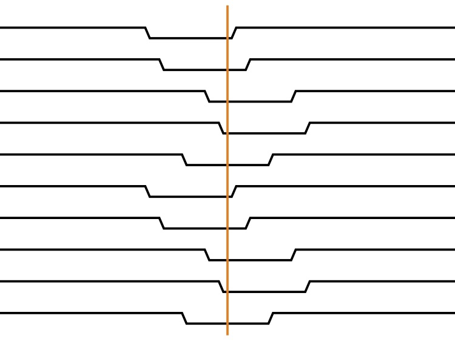

TTV2Fast2Furious
================

Welcome to TTV2Fast2Furious, a set of tools for analyzing transit timing variations.
See the code documentation at https://ttv2fast2furious.readthedocs.io

Install
-------

TTV2Fast2Furious is now on pip::

	pip install ttv2fast2furious
